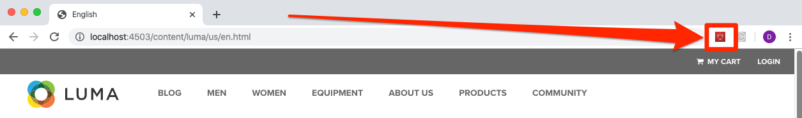
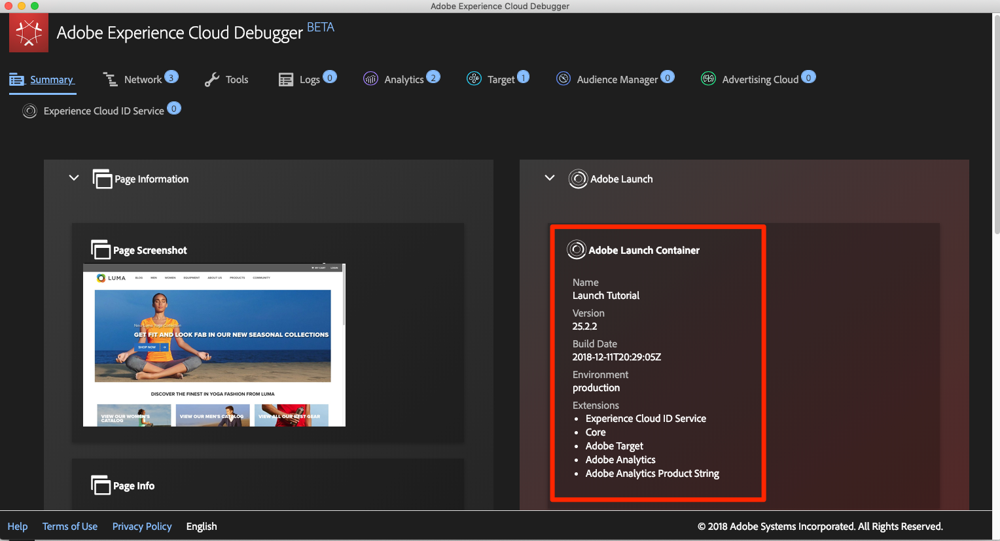
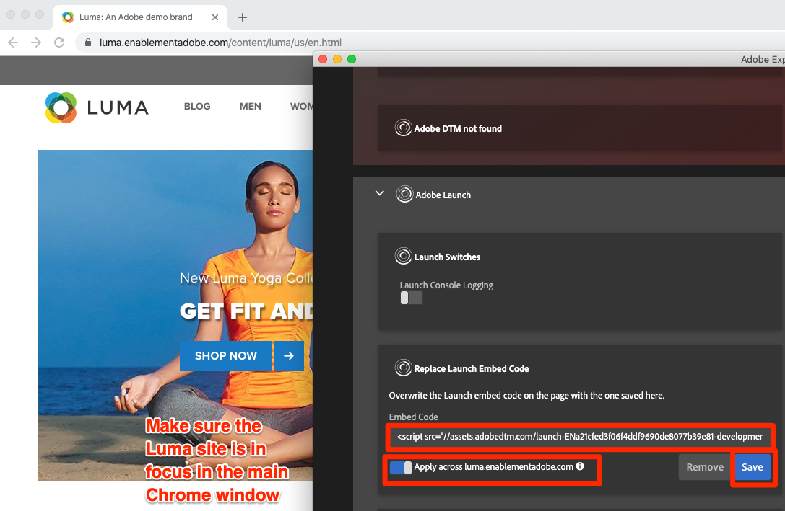

# Switch tags Environments with the Experience Cloud Debugger

In this lesson you will use the [Adobe Experience Cloud Debugger extension](https://chrome.google.com/webstore/detail/adobe-experience-cloud-de/ocdmogmohccmeicdhlhhgepeaijenapj) to replace the tags property hardcoded on the [Luma demo site](https://luma.enablementadobe.com/content/luma/us/en.html) with your own property.

This technique is called environment switching and will be helpful later, when you work with tags on your own website. You will be able to load your production website in your browser, but with your *development* tags environment. This enables you to confidently make and validate tags changes independently from your regular code releases.  After all, this separation of marketing tag releases from your regular code releases is one of the main reasons customers use tags in the first place!

>[!NOTE]
>
>Adobe Experience Platform Launch is being integrated into Adobe Experience Platform as a suite of data collection technologies. Several terminology changes have rolled out in the interface which you should be aware of while using this content:
>
> * Platform Launch (Client Side) is now **[[!DNL tags]](https://experienceleague.adobe.com/docs/experience-platform/tags/home.html)** 
> * Platform Launch Server Side is now **[[!DNL event forwarding]](https://experienceleague.adobe.com/docs/experience-platform/tags/event-forwarding/overview.html)** 
> * Edge configurations  are now **[[!DNL datastreams]](https://experienceleague.adobe.com/docs/experience-platform/edge/fundamentals/datastreams.html)**

## Learning Objectives

At the end of this lesson, you will be able to:

* Use the Debugger to load an alternate tags environment
* Use the Debugger to validate that you have loaded an alternate tags environment
  
## Get the URL of your Development Environment

1. In your tags property, open the `Environments` page

1. In the **[!UICONTROL Development]** row, click the Install icon  to open the modal

1. Click the Copy icon  to copy the embed code to your clipboard

1. Click **[!UICONTROL Close]** to close the modal

   

## Replace the tags URL on the Luma Demo Site

1. Open the [Luma demo site](https://luma.enablementadobe.com/content/luma/us/en.html) in your Chrome browser

1. Open the [Experience Cloud Debugger extension](https://chrome.google.com/webstore/detail/adobe-experience-cloud-de/ocdmogmohccmeicdhlhhgepeaijenapj) by clicking the  icon

   

1. Note that the currently implemented tags property is shown on the Summary tab

   

1. Go to the Tools tab

1. Scroll to the section **[!UICONTROL Replace Launch Embed Code]**

1. Make sure the Chrome tab with the Luma site is in focus behind the Debugger (not the tab with this tutorial or the tab with the Data Collection interface).  Paste the embed code that is in your clipboard into the input field

1. Toggle on the "Apply across luma.enablementadobe.com" feature so that all pages on the Luma site will map to your tags property

1. Click the **[!UICONTROL Save]** button

   

1. Reload the Luma site and check the Summary tab of the Debugger. Under the Launch section, you should now see your Development Property is being used. Confirm that both the Name of the property matches yours and that the Environment says "development."

   

>[!NOTE]
>
>The Debugger will save this configuration and replace the tags embed codes whenever you come back to the Luma site. It will not impact other sites you visit in other open tabs. To stop the Debugger from replacing the embed code, click the **[!UICONTROL Remove]** button next to the embed code in the Tools tab of the Debugger.

As you continue the tutorial, you will use this technique of mapping the Luma site to your own tags property to validate your tags implementation. When you start using tags on your production website, you can use this same technique to validate changes.

[Next "Add the Adobe Experience Platform Identity Service" >](id-service.md)
