# Lesson 1 - Schema: Explore and Define XDM Schema

## Objective

1. Understand the structure of XDM Schema
2. Learn to list, lookup, create, and extend schema in API

## Lesson Resources

- Profile XDM in JSON format (to inspect): [ProfileXDM.json](../assets/profileXDM.json)

## Lesson Context

When setting up an Experience Platform environment as Luma, we will want to bring in data through batch ingestion or streaming in data from the Luma website. This will first require us to define the schema that we want to use for our data. A quick rundown on XDM Schema: these are the defining schema that all datasets on Experience Platform will use. They begin with a starting class of either person-related profile or time-based event data, and Platform users are able to add additional "mixins" to each class to extend their schema to the data fields they require. There are several global mixins that come packaged with Experience Platform, and users are also able to define their own mixins to fit their specific use-cases.

Using the Experience Platform APIs, a suite of abilities to view, extend and create schema are available to you within the API. In order to start, we often utilize either the Profile or ExperienceEvent schema class as our base, and add "mixins" to extend our schema to fit the use case of what data we're looking to ingest. If we want to do that, or define a custom schema, it is sometimes easier to do so with a JSON representation that we can submit as a POST call rather than defining each field in the Experience Platform UI.

## Exercise 1.1 - Schema Lookup

1. Now that you've successfully been authenticated by following the steps in [previous lesson](#lesson-0---authentication-login-and-accessing-with-postman) you are now ready to make API calls.
1. Start by expanding the `Lesson 1` & `List Schemas` folder in postman under `L778`.
1. Select the `XDM: Get All Classes` action and click `Send`.

   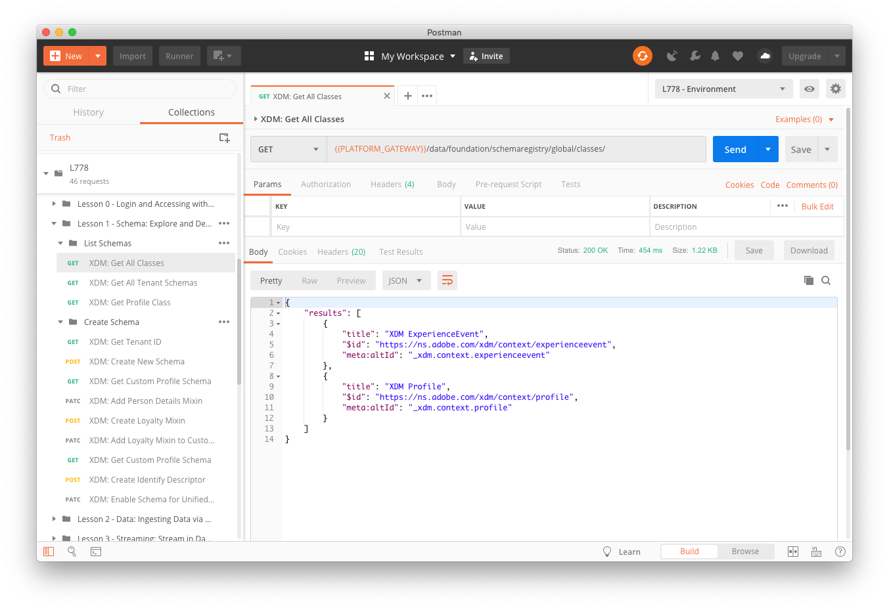

   In the response pane you can scroll down and see the classes that are available in XDM. The ExperienceEvent class is used as a base for time based data while Profile is used for person based data.

1. Let's drill down a bit and view the `Profile` class. If you select `XDM: Get Profile Class` and click `Send` you should see something similar to:

   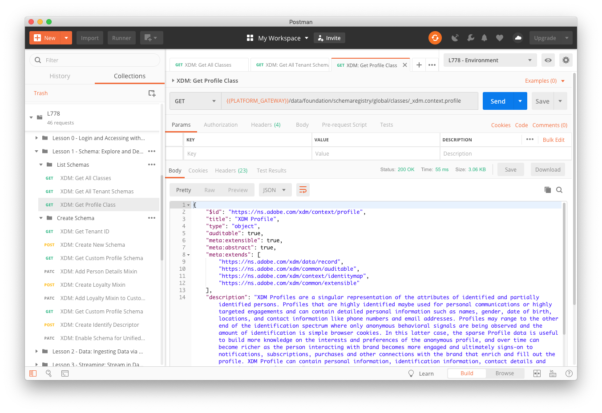

1. There are not many classes in XDM but they are used as the base for all tenant schemas. If you select `XDM: Get All Tenant Schemas` and click `Send` you should see something similar to:

   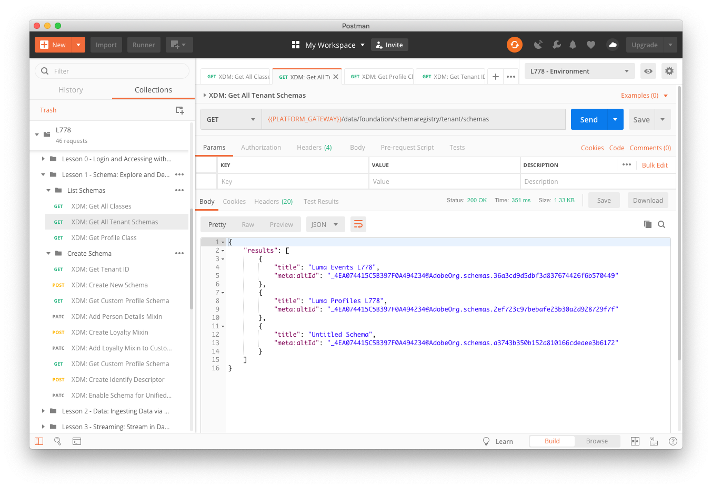

   This will list all of the schemas that have already been created for this tenant.

1. Now select `XDM: Get All Mixins` and click `Send` you should see something like the following:

   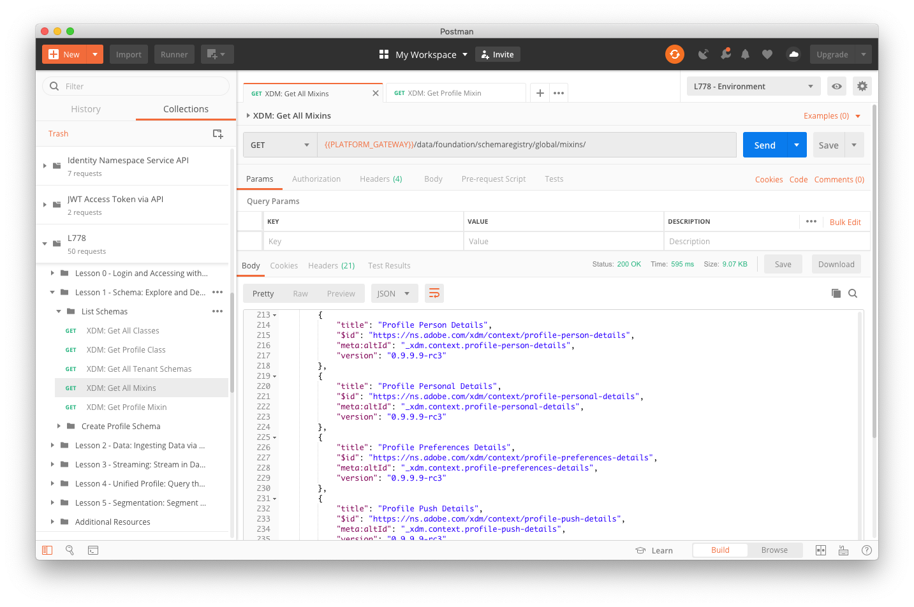

   This will return all of the mixins that ship with Experience Platform. Scroll down until you see `Profile Personal Details` which we are going to look up next.

1. Now select `XDM: Get Profile Mixin` and click `Send` you will see the following:

   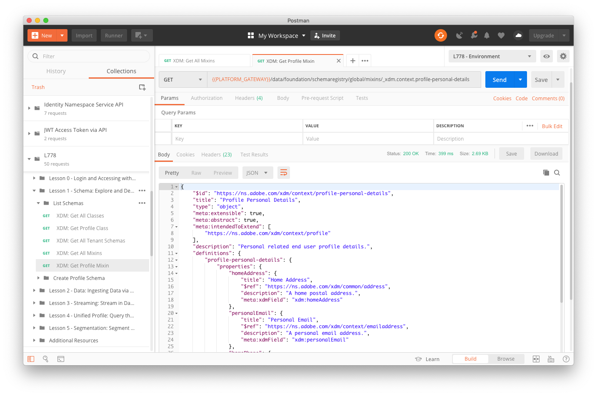

   This is a mixin you will add to your schema when you need common personal details like home address, home phone, etc.

## Exercise 1.2 - Schema Creation

1. Now that we've seen the API calls to query schema let's move on to creating a custom schema of our own. Expand the `Create Schema` folder under `Lesson 1` in postman and select `XDM: Get Tenant ID` and click `Send`.

   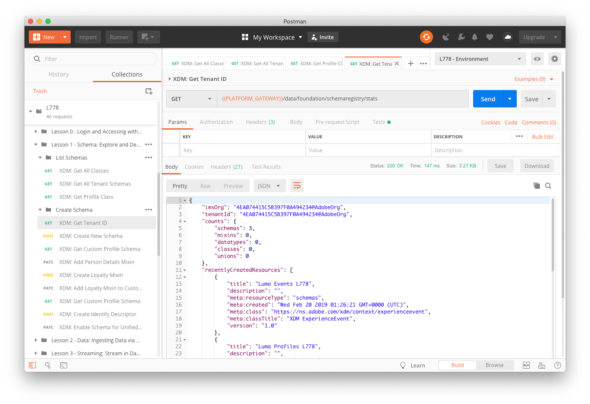

   This API call will determine which tenant you are currently logged in as and save the value as an environment variable in postman for future API calls.

1. Now select `XDM: Create New Schema`.

   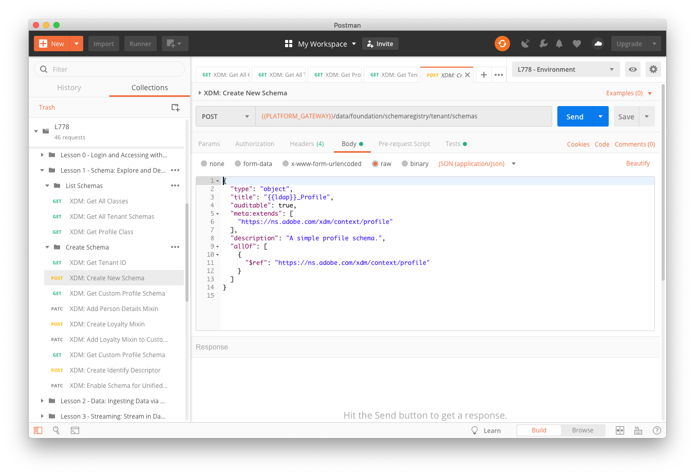

   As you can see, our simple schema extends "context/profile" and that's it. At its most basic, a schema need only extend a class which will capture the minimum viable schema. This schema will be named `L778+[AccountID]_Customers_Schema`, as it is the schema we will be using for user profile data ingestion in Lesson 2.

   Click `Send`

   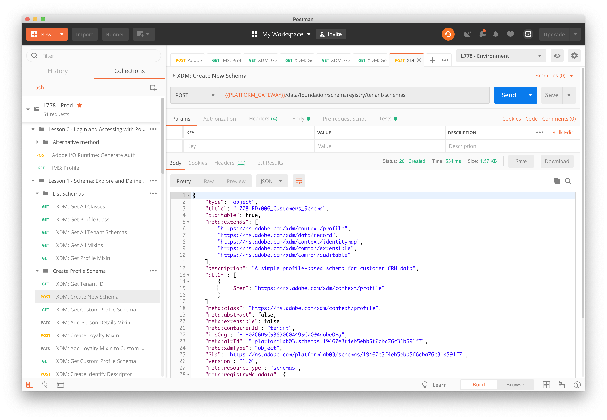

   In the response section you will the ID of your newly created schema which we will be using to create a dataset in `Lesson 2`.

1. Now select `XDM: Get Custom Profile Schema` and click `Send`.

   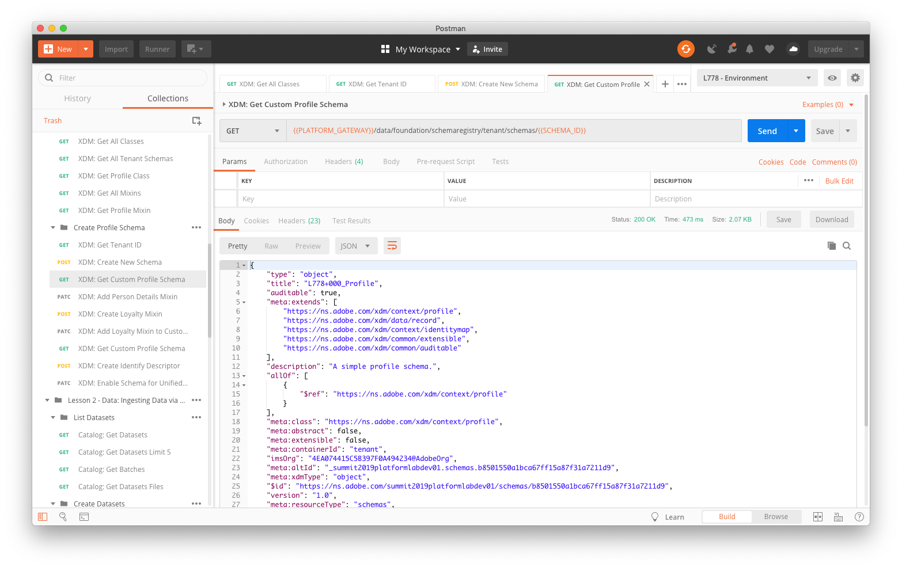

   The response section should return the details of the schema which look an awful lot like `Profile` class because that is the base of our schema. In the `meta:extends` section you can see our schema extends the `Profile` class as well as the four entities (record, auditable, identitymap and extensible) that the `Profile` class extended.

1. Now that the schema has been created we can add Mixin's to it. The mixins available for use will depend on the class selected. Mixins provide fields for any schemas that extends the same specific class. This allows a concept, like "person details", to be predefined so that they can be reused in any schema that needs to capture that information. Let's add the "profile person details", "profile personal details" and "profile preferences details" mixins to our simple schema so that we can capture the typical details of a person, such as full name, birthday, etc. as part of this profile schema.

   Select `XDM: Add Person Details Mixin`

   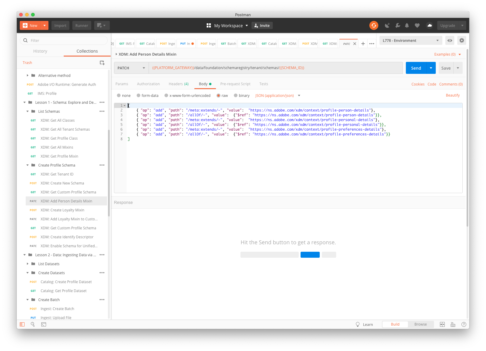

   Click `Send`

   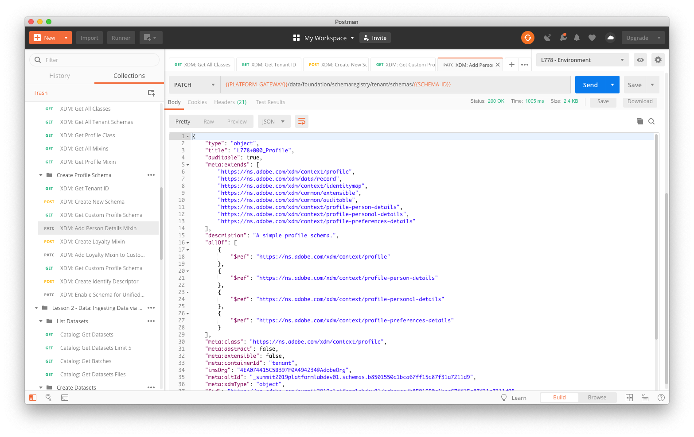

   You will notice there is a new entries in the `meta:extends` section for `profile-person-details`, `profile-personal-details` and `profile-preferences-details`.

1. We would also like our schema to capture information related to a loyalty program. There is no out-of-the-box loyalty mixin, so will create a new mixin of our own. The Loyalty mixin defines a loyalty field that can now be reused in any Profile-based schema. Select the `XDM: Create Loyalty Mixin` and take a look at the Body tab to see the JSON for our Loyalty mixin:

   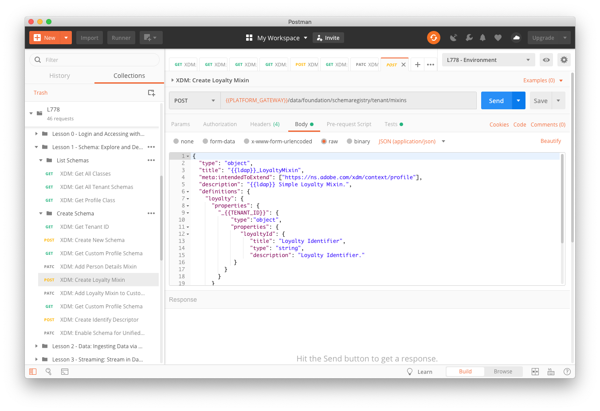

   Click `Send`.

   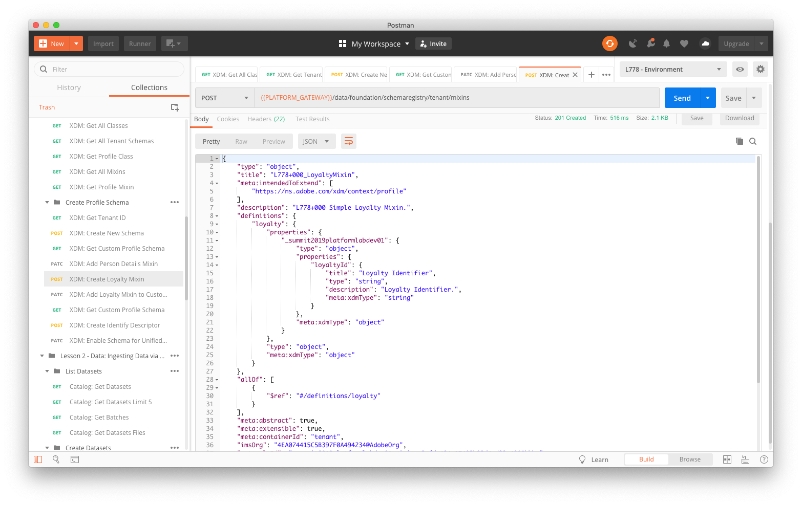

   In the response section you will the ID of your newly created mixin. The ID of the mixin will be stored in an environment variable in postman which will be used in our next step.

1. Select `XDM: Add Loyalty Mixin to Custom Profile Schema`. The following API call will update the simple profile schema to include the Loyalty mixin. The body of the request includes the "MIXIN_ID" of the newly created Loyalty mixin.

   

1. Now select `XDM: Get Custom Profile Schema` so we can lookup the schema and see the changes that have been made to the schema definition.

   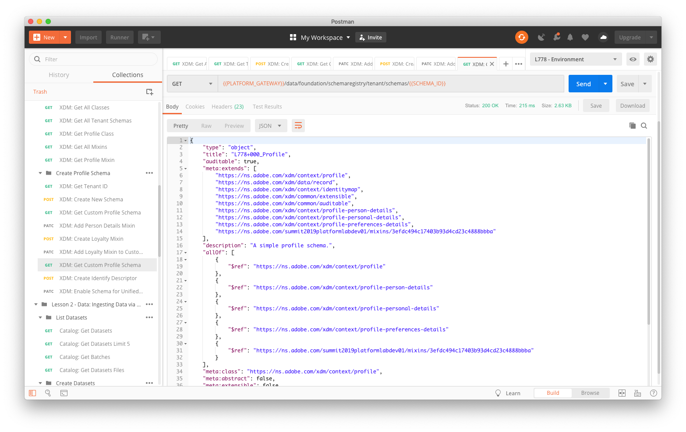

   You'll notice there is a new mixin in the `meta:extends` section.

1. Now we need to make the "address" field within the personalEmail mixin an identity so that values for that field are added to the identity graph. To do this we need to create an identity descriptor that references the "personalEmail.address" field and defines the details of the identity that the email address data represents. This identity descriptor can be added for multiple fields to define as an key field to identify schema data for Unified Profile. In our case, we are only adding one, and making sure to mark it as the primary identifier. Select `XDM: Create Identify Descriptor` and look at the structure of the descriptor on the body tag:

   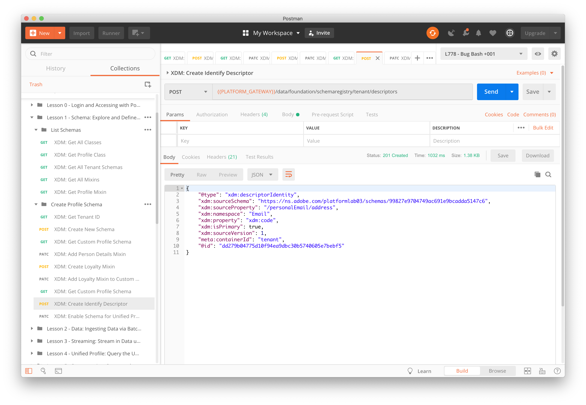

   Click `Send`.

   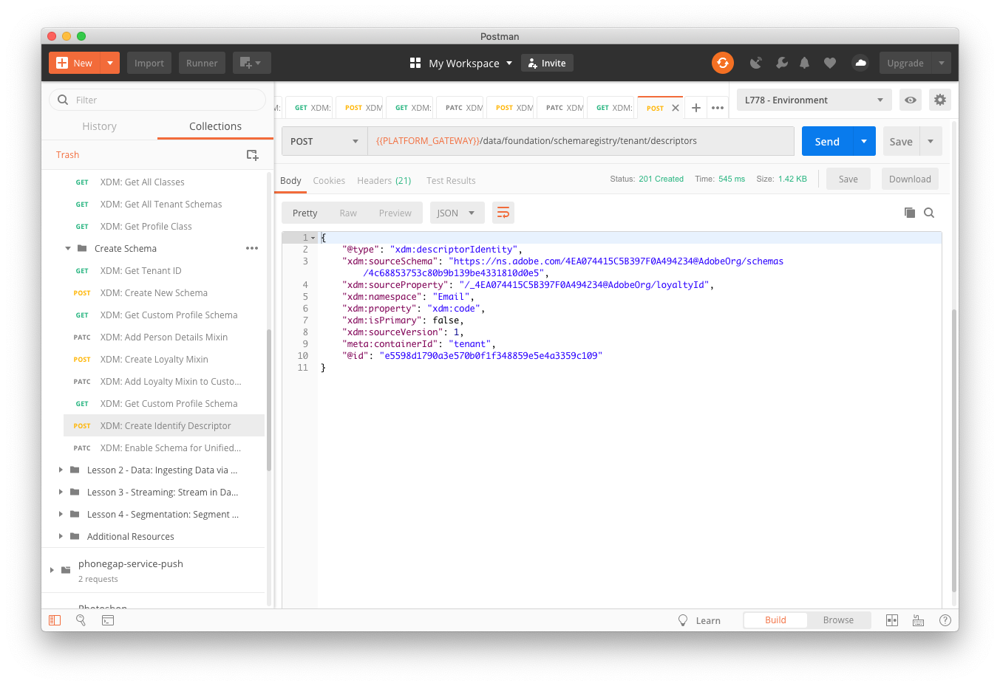

1. When creating schema, it's also possible to enable a schema for Unified Profile, one of Experience Platform's most useful features. In fact, for a dataset to be ingested into the Unified Profile, its underlying schema must be enabled for Unified Profile aswell. To enable this we need to add "union" to the "meta:immutableTags" property of the schema. Select `XDM: Enable Schema for Unified Profile`.

   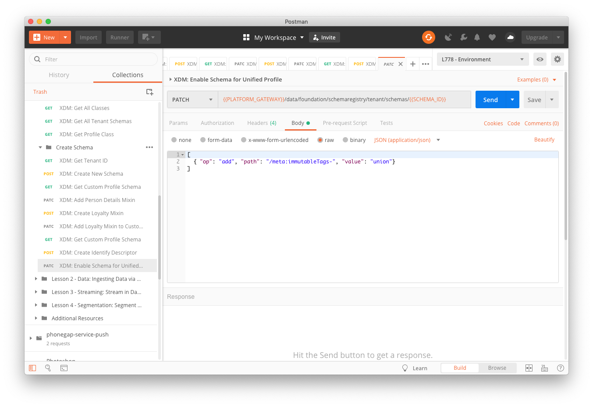

   Click `Send`.

   

   Your completed profile-based schema, `L778+[AccountID]_Customers_Schema`, with Unified Profile enabled is now ready for batch data ingestion of user profile data.

## Lesson 1 - Wrap

With the creation of our custom schema we are ready to move on to the next step of creating datasets and data ingestion.

## Lesson 1 - Additional Resources

- [Experience Data Model (XDM) System](https://www.adobe.io/apis/experienceplatform/home/xdm.html)
- [Catalog Service RESTful API Resource](https://www.adobe.io/apis/experienceplatform/home/api-reference.html#!acpdr/swagger-specs/catalog.yaml)