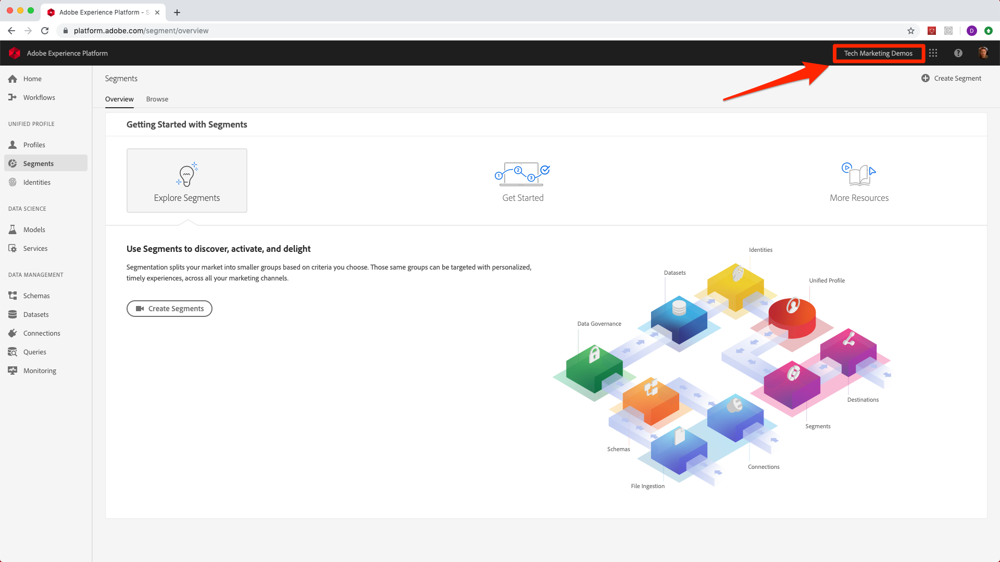
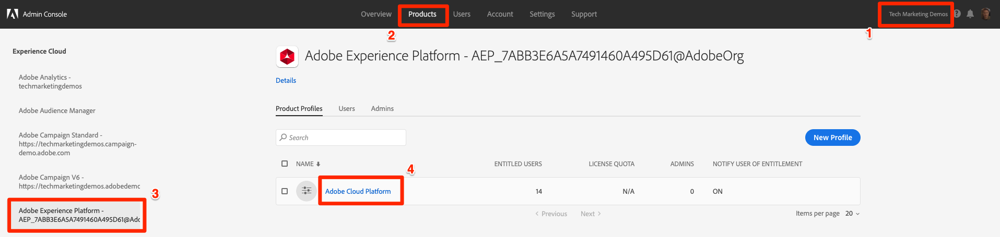
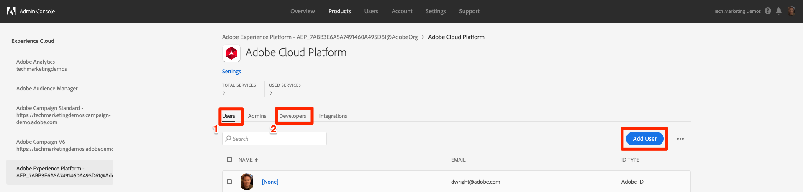

# Assign User Permissions

In this lesson you will assign yourself user- and developer-level access to your organization's Experience Platform account. If you already have this level of access, you can proceed to the next lesson.

## Prerequisites

In order to complete this lesson, your organization must be provisioned for Experience Platform and you must have an Adobe Id. Also, a System Administrator for your Adobe solutions will need to complete these steps. If you are not a System Administrator, reach out to one of your organization's System Administrators and ask them to give you access following the steps below.
<!--what is the best way to find out who is a System Administrator is? Also, is there a "Platform Administrator" role and could that person do this?-->

## Learning Objectives

At the end of this lesson, a System Administrator will be able to:

* Assign user-level access to Platform so users can access the Platform User Interface
* Assign developer-level access to Platform so users can use the Platform API

## Unsure if you already have access?

### Check User-level Access

1. Go to [https://platform.adobe.com](https://platform.adobe.com)
1. Log in using your Adobe Id
1. If you land on the Platform Home screen and are able to select the Experience Cloud Organization you are intending to use for this tutorial, congratulations&mdash;you already have User-level access to Platform! <!--what does it say if the user doesn't have access?--> If you're unable to get to your organization's Platform home screen, ***reach out to a System Administrator to request user-level access to Platform and repeat these steps again once they have assigned access.***
  

### Check Developer-level Access

If you think you might already have Developer-level access, try completing the steps in the next lesson. If you are unable to get to the screens in which you configure the Platform API integration, If you're unable to get to your organization's Platform home screen, ***reach out to a System Administrator to request user-level access to Platform and repeat these steps again once they have assigned access.***

## Assign User- and Developer-level access

These steps are for administrators to give people access to Platform. You may manage users differently in your organization and use more granular Product Profiles pictured in these instructions. Feel free to deviate from these instructions as needed to fit your organization's practices, the main thing is that the user must have both user-level and developer-level privileges to Platform in order to use the API and complete this tutorial:

1. Log into the [Admin Console](http://adminconsole.adobe.com)
1. Confirm you are in the desired Organization
1. Click on **[!UICONTROL Products]** in the top navigation
1. Click on **[!UICONTROL Adobe Experience Platform]** in the left navigation
1. Click on the **[!UICONTROL Product Profile]**
  
1. On the **[!UICONTROL Users]** tab, click **[!UICONTROL Add User]** and complete flow to give the user user-level privileges
1. Click on the **[!UICONTROL Developers]** tab and then click **[!UICONTROL Add User]** again and complete flow to give the user developer-level privileges
  
1. Notify the user and have them confirm their access
<!--is this step necessary or are notifications automatically sent? -->

[Next "Create the Adobe I/O Integration" >](create-the-adobe-io-integration.md)