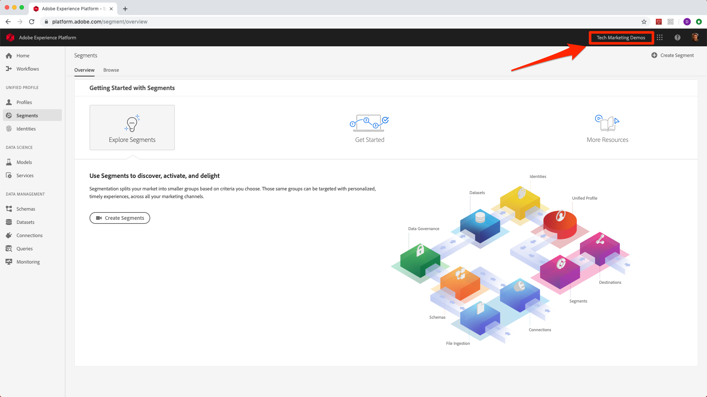
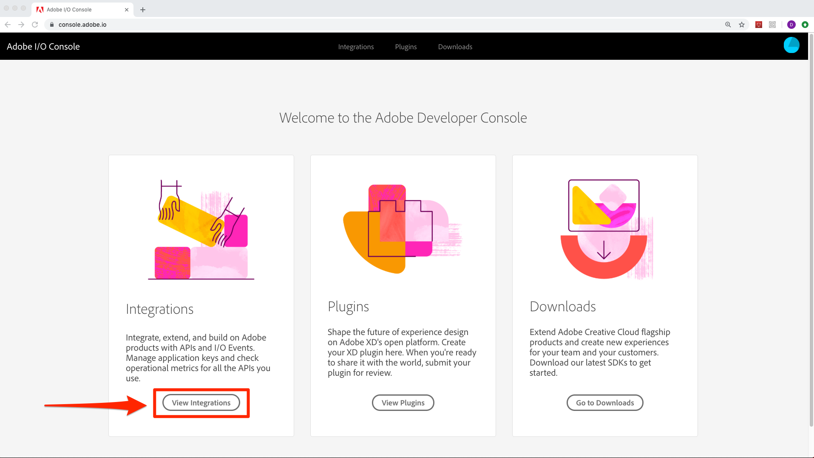
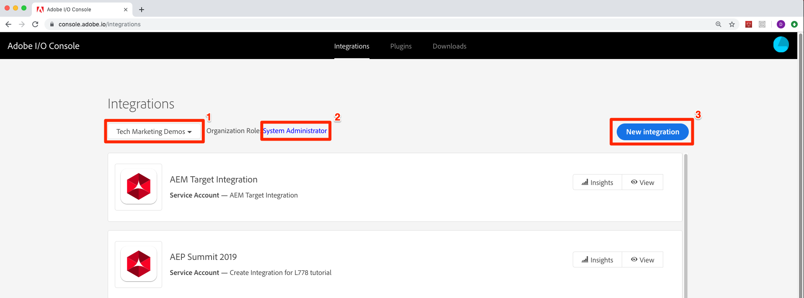
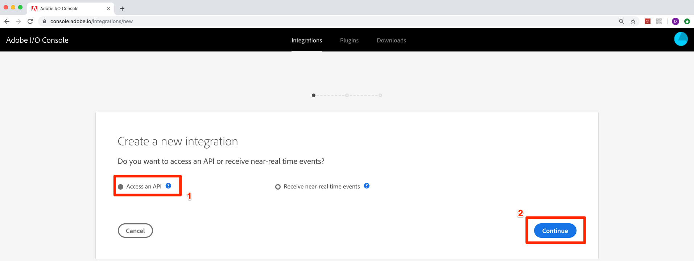
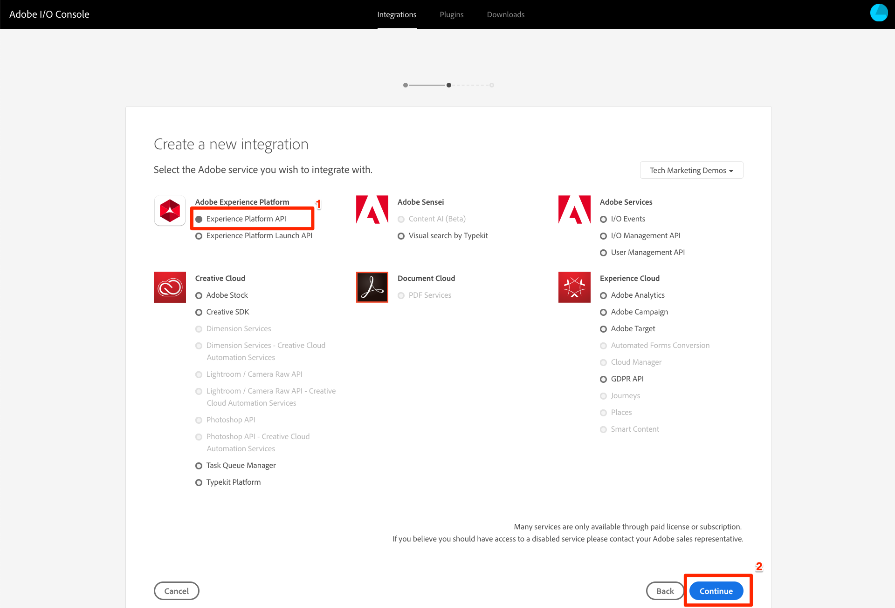

# Assign User Permissions

In this lesson you will get the user- and developer-level access to your organization's Platform account.

## Prerequisites
 
 In order to complete this lesson, your organization must be provisioned for Platform. Also, if you do not already have user- and developer-level access to your organization's Platform account, you will need Administrator-level access to the organization or request an administrator

## Learning Objectives

At the end of this lesson, you will be able to:

* Assign users access to Platform User Interface
* Assign users access to Platform API

## Check if you already have access

### Confirm User-level Access

1. Go to [https://platform.adobe.com](https://platform.adobe.com)
1. Enter the email address associated with your Adobe Id
1. Select the type of account your organization uses for access to Adobe Experience Cloud solutions (Personal or Company)
1. Enter your password

After logging in, if you land on the Platform Home screen and are able to select the Experience Cloud Organization you are intending to use for this tutorial, congratulations&mdash;you already have User-level access to Platform!

  

### Confirm Developer-level Access

1. Go to [https://console.adobe.io](https://console.adobe.io)
1. Log in, if prompted
1. If you land on the Adobe I/O Console home screen, click "View Integrations"

  

1. Make sure the Experience Cloud Organization you are intending to use for this tutorial is selected in the dropdown
1. If the **[!UICONTROL Organization Role]** says "Developer" or "Administrator" that is a good sign
1. Click New integration

  

1. Make sure **[!UICONTROL Access an API]** is selected
1. Click **[!UICONTROL Continue]**

  

1. Select **[!UICONTROL Experience Platform API]**
1. Click **[!UICONTROL Continue]**

  

