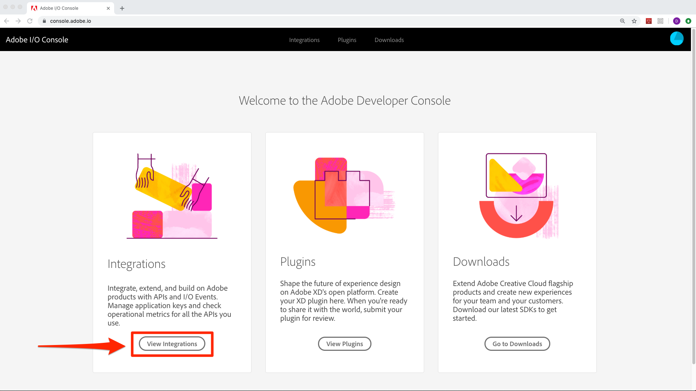
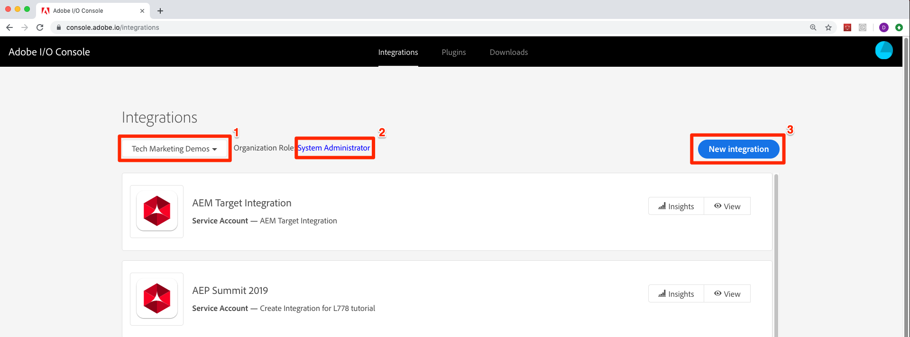
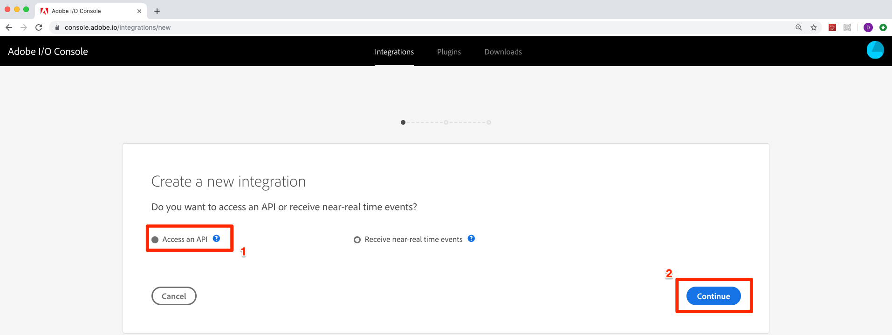
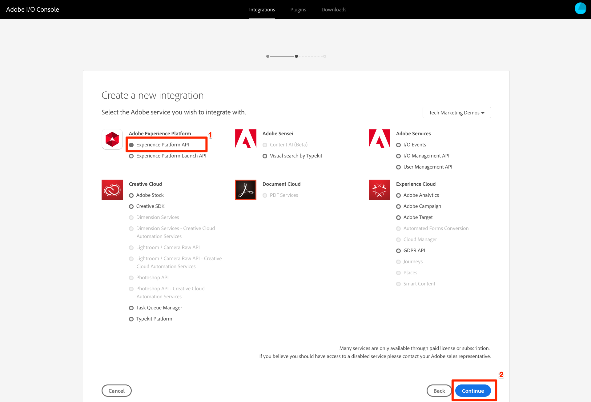
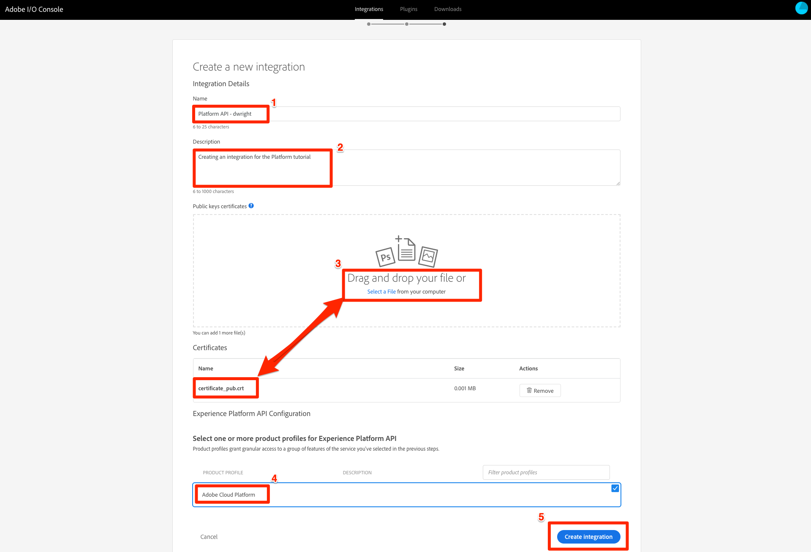
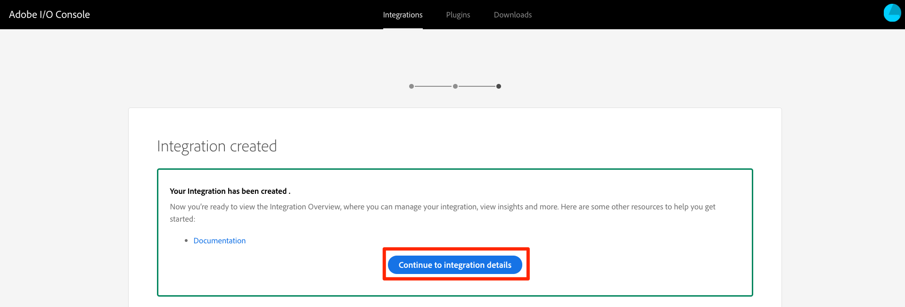
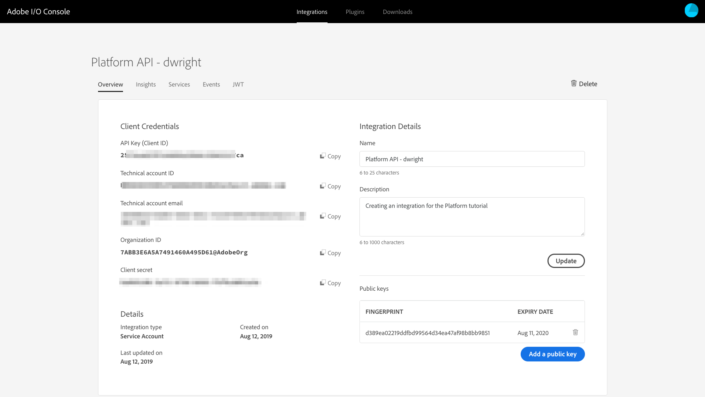

# Create the Integration in Adobe I/O

Adobe I/O is Adobe's developer ecosystem and community. It consists of the [adobe.io](https://www.adobe.io) website, the Adobe I/O developer tools and APIs, APIs for all Adobe products, and our social media presence.

In order to make API calls to your Platform account you will need to create a new Integration in the Adobe I/O Console. When you create an Integration, you are assigned an API Key (client ID) and other access credentials. You can then obtain a secure access token from Adobe for each API session.

For service-to-service integrations such as with Experience Platform, you will also need a JSON Web Token (JWT) that encapsulates your client credentials and authenticates the identity of your integration. You exchange the JWT for the access token that authorizes access.

An integration can be subscribed to one or more services. In many cases, you will use the same client credentials to access multiple Adobe services. In addition to APIs, you may also subscribe your integration to I/O Events so that your applications can access content and services in real-time.
<!-- do we have I/O Events for Platform that we should cover in this tutorial?-->

## Create the Certificate

<!--need to provide an overview of how real companies create and manage these types of certificates. Also need a windows version-->
<!--do we need guidance on what local directory they should create the certificate in? does it matter? in the training i think Thomas suggested keeping things organized for each org you would have access to-->
<!--definitely need to polish the statements about certificate creation and using an existing one-->

1. Mac Users: Open Terminal

1. Next you will use OpenSSL to generate a a private key and self-signed certificate with a public key. Since this certificate will only be used in your local environment for this tutorial, we do not need to sign it by Global Certificate Authority. After completing the tutorial and when you are getting ready to start incorporating the API in to your own applications, you will need to create a signed certificate. Alternatively, if you have a signed certificate, you can skip the next few steps and use it instead.  Execute the command below in your Terminal window:

   ```shell
   openssl req -x509 -sha256 -nodes -days 365 -newkey rsa:2048 -keyout private.key -out certificate_pub.crt
   ```

1. You will get a response similar to the following which prompts you to enter some information about yourself:

    ```shell
    Generating a 2048 bit RSA private key
    .................+++
    .......................................+++
    writing new private key to 'private.key'
    -----
    You are about to be asked to enter information that will be incorporated
    into your certificate request.
    What you are about to enter is what is called a Distinguished Name or a DN.
    There are quite a few fields but you can leave some blank
    For some fields there will be a default value,
    If you enter '.', the field will be left blank.
    -----
    Country Name (2 letter code) []:
    State or Province Name (full name) []:
    Locality Name (eg, city) []:
    Organization Name (eg, company) []:
    Organizational Unit Name (eg, section) []:
    Common Name (eg, fully qualified host name) []:
    Email Address []:
    ```

After entering the information two files will be generated: `certificate_pub.crt` and `private.key` in the same directory from which you ran the `openssl` command.

The `certificate_pub.crt` certificate will later be uploaded to the Adobe IO Console for when you create an API key for access to any Adobe I/O API.

Your private key file named `private.key` will be used later to sign your JWT token.

>[!NOTE]
>
> Don't close this terminal window as you will need it later.

## Create the Integration in the Adobe I/O Console

1. Navigate to the [Adobe I/O Console](https://console.adobe.io/) and sign in with your Adobe ID.

1. From the Adobe I/O Console home screen, click **[!UICONTROL View Integrations]**
  

1. Make sure the Experience Cloud Organization you are intending to use for this tutorial is selected in the dropdown
1. Note that with the correct user access privileges assigned in the previous lesson, **[!UICONTROL Organization Role]** should say [!UICONTROL Developer] or [!UICONTROL Administrator].
1. Click New integration
  

1. Make sure **[!UICONTROL Access an API]** is selected
1. Click **[!UICONTROL Continue]**
  

1. Select **[!UICONTROL Experience Platform API]**
1. Click **[!UICONTROL Continue]**
 

1. Name your integration (we recommend including an identifier for your name) F
1. Add a Descriptiion
1. Upload your public certificate&mdash;the `certificate_pub.crt` file we generated in the previous section
1. Click on Adobe Cloud Platform as the [!UICONTROL Product Profile] (or whatever the appropriate Product Profile is setup in your org) <!--when might there be other profiles? depending on the admin setup? when should they be used? -->
1. Finally, click Create Integration to finish up the process

   

1. After your integration has been created you will land on a screen like the one pictured below. Click **[!UICONTROL Continue to Integration Details]**, 

   
1. You will be able to view the details of your integration. After clicking on Retrieve client Secret your screen should look similar to this (without the blurring!):
   

Copy the values for your {API KEY}, {IMS ORG} which is the Organization ID, and {CLIENT SECRET} as these will be used in upcoming lessons.

[Next "Configure Postman" >](configure-postman.md)